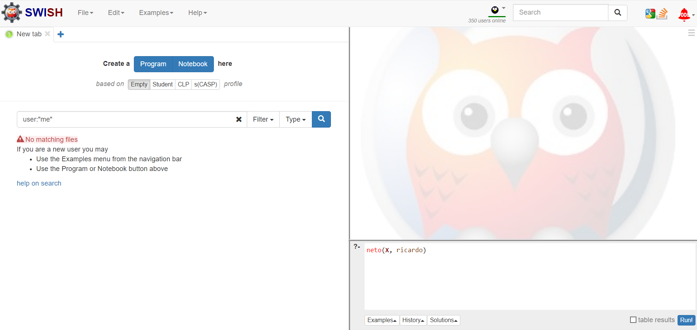
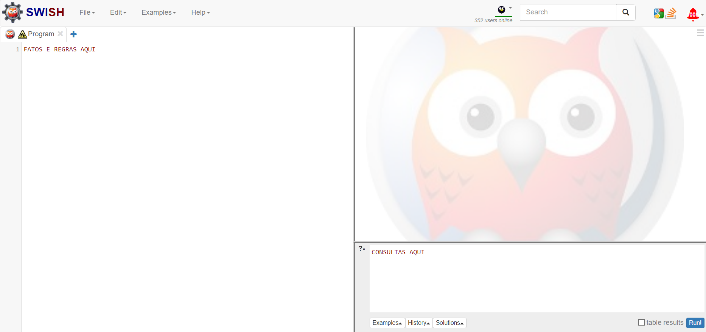
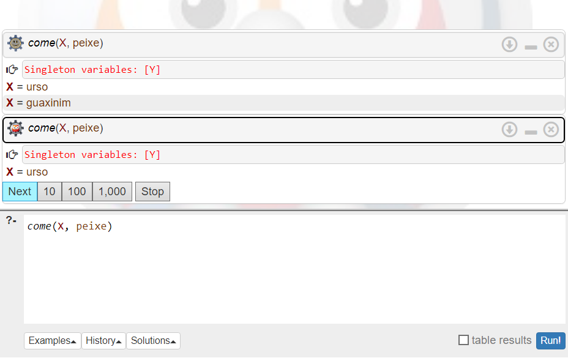
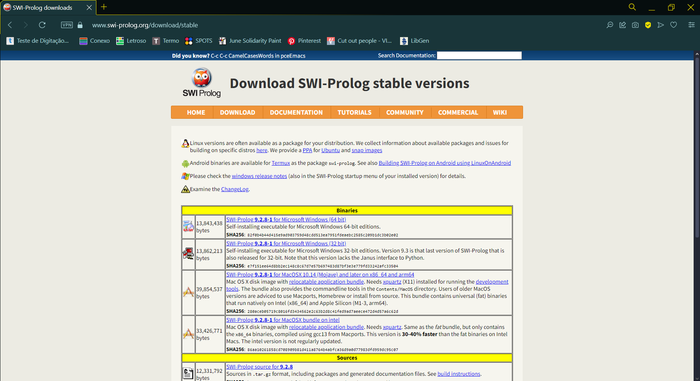
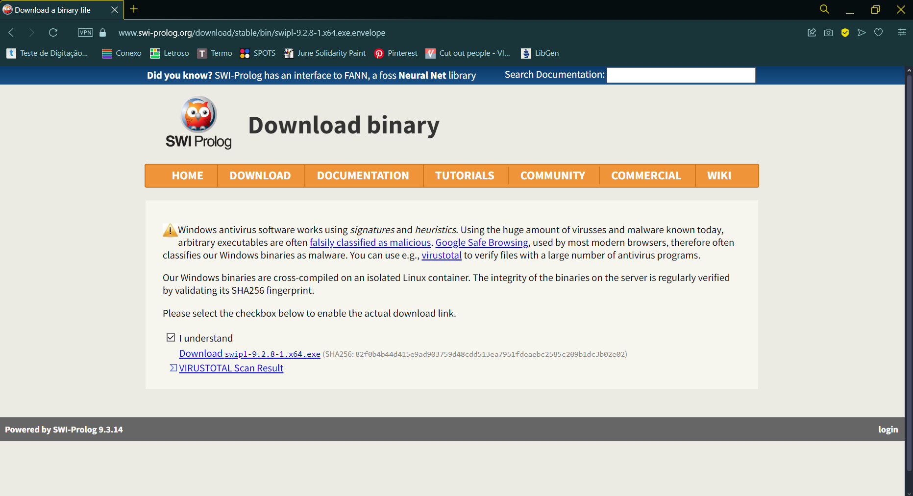

# Programação Lógica para Lógica de Predicados
- cláusulas de horn
- generalização e particularização
  
**Escrito por Aline Daffiny F. gomes**, acadêmica de Sistemas de Informação na Universidade do Estado do Amazonas, entusiasta em Inteligência Artificial, atualmente focada em explorar o campo da Visão Computacional.  
  
**Orientado por [Elloá B Guedes](https://github.com/elloa)**

## Sumário
1. [Introdução](#ancora0)
2. [O que é Prolog?](#ancora1)  
3. [Instalação](#ancora2)
- [Online](#ancora2-1)
- [Para Windows](#ancora2-2)
- [Para Linux Ubuntu](#ancora2-3)
4. [Programando em Prolog](#ancora3)
  - [Fatos](#ancora3-1)
  - [Regras](#ancora3-2)
  - [Consultas](#ancora3-3)
  - [Quantificadores e Predicados](#ancora3-4)
  - [Negação de quantificadores](#ancora3-5)
  - [Generalização e Particularização](#ancora3-6)
5. [Exercícios](#ancora4)
6. [Referências](#ancora5)


<a id="ancora0"></a>
## Introdução
Uma das grandes dificuldades enfrentada por alunos durante a disciplina de Matemática Discreta é a compreensão da Lógica de Predicados. Conceitos como quantificadores e criação de sentenças podem ser difíceis de visualizar, tornando o cálculo de predicados uma tarefa dificultosa. Nesse contexto, a Programação Lógica pode servir de auxílio ao estudante.  
  
A Programação Lógica segue o paradigma declarativo, onde o foco está em descrever objetivos sem especificar ao sistema como alcançá-los. O programador define regras, relações ou propriedades, e o sistema cuida da execução. A Programação Lógica tem como finalidade principal resolver problemas através da aplicação de regras lógicas e dedução automática e é usada principalmente na área da Inteligência Artificial, como o Processamento de Linguagem Natural e Bancos de Dados Inteligentes.  
  
Atualmente, Prolog é a linguagem mais amplamente usada para escrever o Programção Lógica, portanto, essa será durante esse turorial.  
  
<a id="ancora1"></a>
## O que é Prolog?  
Criada em 1972 por Alain Colmerauer e Philippe Roussel, Prolog, abreviação de PROgramming LOGic, é uma linguagem de programação baseada nas noções matemáticas de relações e inferência lógica. Prolog é considerado uma **linguagem declarativa**, o que significa que, diferentemente de linguagens procedurais como Pyhton, que descrevem o passo a passo de como computar uma resposta, Prolog consiste numa base de dados de **fatos e regras** que descrevem as relações que moldam o sistema, o usuário então pode fazer uma **consulta** e o sistema responde com base no banco de dados. As sentenças em Prolog são formadas a partir de termos.  
  
Um **termo** Prolog pode ser uma constante, uma variável ou uma estrutura. Uma constante é um átomo ou um inteiro, onde átomos são os valores simbólicos de Prolog, como *sol, 'casa branca',* ou *true*, e inteiros são os números do conjunto dos inteiros. Uma variável é qualquer cadeia de letras, dígitos e sublinhados que iniciam com uma letra maiúscula, por isso, é importante se atentar para escrever os fatos e regras em letras minúsculas, do contrário, serão interpretados como variáveis. E por fim, uma estrutura é composta por um functor e seus argumentos, como em *pessoa(maria, 21, engenheira)*, onde "pessoa" é o functor e "maria, 21, engenheira" são os argumentos.
  
Os **fatos** declaram relações ou caractertísticas para os itens de um conjunto universo. 
  
- *"Hoje está ensolarado"* atribui a característica "ensolarado" para o item "hoje" de um conjunto de dias;  
- *"João e Ana são irmãos"*  estabelece a relação "irmãos" aos itens "João" e "Ana" de um conjunto de pessoas
  
As **regras** são predicados condicionais, definem novas relações usando relações que já existem.  
- *"Vou sair se hoje estiver ensolarado"* estabelece uma regra, onde "sair" só acontece se "hoje estiver ensolarado" for verdade;  
- *"Se está chovendo e preciso sair, uso o guarda-chuva"*  define que apenas "uso o guarda-chuva" se "está chovendo" e "preciso sair" são verdades simultaneamente.
  
Por último, as **consultas** são o meio de solicitar informações de um banco de dados.  
- *"Marcos é pai de João"* (fato)  
- *"Marcos é pai de Lucas"* (fato)  
- *"X é filho de Y se Y é pai de X"* (regra)  
- *"Quem é filho de Marcos?"* (consulta)
  
  
    
<a id="ancora2"></a>
## Instalação  

<a id="ancora2-1"></a>
### Online
Caso não queira instalar o ambiente do SWI Prolog, o mesmo possui uma versão online, o [SWISH](https://swish.swi-prolog.org). Ao acessar o link, você encontrará a seguinte tela:  

1. Clique no botão azul "Program" para criar um novo banco de dados Prolog.  
2. Escreva os fatos e regras do lado esquerdo. Para fazer consultas, utilize o terminal localizado no canto inferior direito.

3. Para executar, clique no botão azul "Run!".
4. Se sua consulta possui vários resultados, clique em "Next". O terminal não oferecerá essa opção uma vez que todos os resultados possíveis forem exibidos.


<a id="ancora2-2"></a>
### Para Windows
1. Acesse o link <https://www.swi-prolog.org/download/stable>  
2. No bloco "Binaries" selecione a versão que melhor se adequa à sua máquina
  
3. Selecione a caixa "I understand" e clique no link de download logo abaixo

4. Após concluir o download, vá para o arquivo e execute-o para iniciar a instalação. É recomendado adicionar o ícone à tela inicial
5. Não esqueça de reiniciar a máquina após concluir a instalação
Se precisar de mais ajuda, tente verificar um [tutorial no YouTube](https://www.youtube.com/watch?v=vnGWJxl1Cbk)

<a id="ancora2-3"></a>
### Para Linux Ubuntu  
1. Execute as seguintes linhas de código no seu terminal:  
```
% sudo apt-add-repository ppa:swi-prolog/stable
% sudo apt-get update
% sudo apt-get install swi-prolog
```
2. Crie um arquivo .pl e edite o arquivo com o editor de texto de sua preferência, escrevendo os fatos e regras.
3. Volte para o terminal e escreva a seguinte linha, usando o nome do seu arquivo:
```
swipl -s arquivoProlog.pl
```
4. Escreva suas consultas no terminal.
  
<a id="ancora3"></a>
## Programando em Prolog

<a id="ancora3-1"></a>
### Fatos
Fatos são proposições verdadeiras na linguagem da Lógica Matemática. Em Prolog elas seguem a estrutura ***relação*(*itens que participam da relação*)** e são delimitados por um ponto final, tais como em:
- pai(marcos, joão).  
- nublado(hoje).
  
Note que Prolog não tem semântica intrínseca, logo, o significado dos fatos depende da interpretação do programador. A relação *pai(marcos, joão)* poderia significar que Marcos é pai de João, João é pai de Marcos ou que Marcos e João são pais. Por isso, tente ser claro ao nomear as relações.

<a id="ancora3-2"></a>
### Regras  
Sendo um condicional, as regras são compostas por um antecedente, que pode ser um termo simples ou uma conjunção, e caso este seja verdadeiro, gera um consequente, que é um termo simples. Para entender as regras em Prolog, é necessário saber também os operadores usados:  
| SÍMBOLO |   CONECTIVO  | OPERAÇÃO LÓGICA |
| :---:   |    :----:    |      :---:      |
| :-      | if (se)      |    implicação   |
| ,       | and (e)      |    conjunção    |
| ;       | or (ou)      |    disjunção    |
| \\+     | not (não)    |     negação     |  
  
Em Prolog, o consequente é escrito primeiro e, em seguida, é atribuida uma condição a ele, seguindo a estrutura ***consequente* :- *expressão antecedente.***, como em:
- presa(X) :- come(Y,X), animal(X).
  
Nesta regra, X é presa **se** Y come X **e** X é um animal.  

<a id="ancora3-3"></a>
### Consultas
A sintaxe das consultas em Prolog é bem semelhante a dos fatos. Para fazer uma consulta em Prolog, usa-se ?- e escreve-se uma regra. O sistema deve retornar todas os itens que atendem a esta regra. Observe o seguinte exemplo:  
Levando em consideração o seguinte banco de dados Prolog
```
pai(milton, maria).
pai(milton, juliano).
pai(ricardo, milton).
pai(leandro, andrea).
filho(X, Y) :- pai(Y, X).
neto(X, Z) :- pai(Z, Y), filho(X, Y).
```
A consulta *?-neto(X, ricardo)* representa quem são os netos de ricardo. O sistema deve responder "maria" e "juliano", sempre seguindo a ordem em que foram escritos no banco de dados. Independente se estiver usando o site SWISH ou a interface SWI Prolog, o ?- já é adicionado automaticamente, então não é necessário escrevê-lo.  
  
**Tente fazer os seguintes exercícios, utilizando o que aprendeu até agora**  
1. Gersting<sup>[[1]](#ref_gersting)</sup>, Seção 1.5 - PROBLEMA PRÁTICO 28  
   Dado o Banco de Dados:
```
come(urso, peixe).
come(urso, raposa).
come(veado, grama).
animal(urso).
animal(peixe).
animal(raposa).
animal(veado).
planta(grama).
```
Diga qual vai ser a resposta do sistema à consulta *?-come(X, Y), planta(Y)*  

  
2. Gersting<sup>[[1]](#ref_gersting)</sup>, Seção 1.5 - PROBLEMA PRÁTICO 29  
   Dado o banco de dados:
```
come(urso, peixe).
come(peixe, peixinho).
come(peixinho, alga).
come(guaxinim, peixe).
come(urso, guaxinim).
come(urso, raposa).
come(raposa, coelho).
come(coelho, grama).
come(urso, veado).
come(veado, grama).
come(lince, veado).
animal(urso).
animal(peixe).
animal(peixinho).
animal(guaxinim).
animal(raposa).
animal(coelho).
animal(veado).
animal(lince).
planta(grama).
planta(alga).
presa(X) :- come(Y, X), animal(X).
```
&nbsp;&nbsp;a) Formule uma regra de Prolog que define o predicado predador.  
&nbsp;&nbsp;b) Adicione essa regra ao banco de dados e diga qual seria a resposta à consulta *?- predador(X)*.  

<a id="ancora3-4"></a>
### Quantificadores e Predicados
Agora que há uma base da sintaxe de Prolog, esta seção irá se aprofundar na utilização da linguagem para compreensão da lógica de predicados.  
  
A lógica de predicados possui apenas dois quantificadores, ∀(leia "Para todo") e ∃(leia "Existe"). O ∀ é um quantificador universal, logo, se aplica a todos os itens de um conjunto universo. No exemplo:

> Gersting<sup>[[1]](#ref_gersting)</sup>, Seção 1.3 - PROBLEMA PRÁTICO 15, letra C  
> U (Conjunto Universo): Flores  
> P(x): x é uma planta  
>  
> (∀x)P(x)
  
<a id="ancora_exemplo-flores"></a>
Sabemos que todos os elementos do Conjunto Universo são flores, e que o predicado P(x) significa que x é uma planta, logo, (∀x)P(x) significa *"**Para todo** x (pertencente conjunto universo), x é uma planta"*. Veja em Prolog:
```
flor(rosa).
flor(margarida).
flor(lirio).
flor(tulipa).
flor(girassol).

planta(X) :- flor(X).
```
Foi definido uma série de flores para representar o conjunto universo e uma regra para o predicado "planta". Repare que *planta(X) :- flor(X).* possui o mesmo significado lógico de *(∀x)P(x)*, pois para todo X que é uma flor, X é uma planta. Ao rodar o código com a consulta *?- planta(x)*, obtemos:
```
X = rosa
X = margarida
X = lirio
X = tulipa
X = girassol
```
Exatamente todos os elementos do nosso conjunto universo.  

O quantificador ∃ é existencial, se aplicando há *alguns* elementos do conjunto universo. O mesmo pode ser lido como “existe”, “há pelo menos um”, “existe algum” ou “para algum”, use o que for mais conveniente para você. O quantificador existencial implica que não se sabe a quantidade exata, mas que **existe pelo menos um** elemento que se encaixa na relação. Observe o exemplo: 

> U (conjunto Universo): Animais  
> F(x): x é um felino  
>  
> (∃x)F(x)  
<a id="ancora_exemplo-animais"></a>  
Considerando um conjunto universo de animais, e sabendo que F(x) implica que x é um felino, o predicado (∃x)F(x) pode ser lido como *Existe pelo menos um x (pertencente ao conjunto universo) onde x é um felino*. Aplicando em Prolog, considere o seguinte banco de dados:
```
animal(macaco).
animal(tigre).
animal(coruja).
animal(gato).
animal(cachorro).
animal(rato).
  
felino(tigre).
felino(gato).
primata(macaco).
roedor(rato).
canino(cachorro).
domestico(gato).
domestico(cachorro).
domestico(rato).
tem_asas(coruja).
```
O conjunto de animais é definido e, em seguida, atribuímos características a eles. Agora faça algumas consultas e observe a resposta do sistema:
```
?- animal(X), felino(X)            %"existe um x que é animal e felino?"
X = tigre
X = gato
false

?- felino(X), domestico(X)         %"existe um x que é felino e doméstico?"
X = gato

?- primata(X), tem_asas(X)         %"existe um x que é primata e tem asas?"
false
```
Como demonstrado nas duas primeiras consultas, somente alguns elementos do conjunto universo participam da relação. Na terceira consulta, o sistema retorna *false*, dado que não foi definido nenhum primata que tenha asas.  

Você pode alterar o banco de dados acima e adicionar mais animais, características e regras, faça mais consultas para exercitar a compreensão dos quantificadores.  

  
<a id="ancora3-5"></a>
### Negação de Quantificadores
As regras de dedução da lógica proposicional ainda valem para a lógica de predicados, com a adição de Generalização e Particularização, vistos na próxima seção, e uma pequena mudança na negação. A negação de quantificadores funciona diferente da negação de variáveis, veja, a regra afirma que:

- ¬∀ é equivalente a ∃¬
- ¬∃ é equivalente a ∀¬  
  
Você pode tentar ver da seguinte maneira:

- Se **nem todo mundo**(¬∀) vai à festa, então **existe alguém que não** vai (∃¬).
- Se **não existe alguém**(¬∃) que vá à festa, então **todo mundo não** vai (∀¬).  

Ainda considerando o [exemplo dos animais](#ancora_exemplo-animais), executado na seção anterior, nem todos os animais são felinos, logo, ¬(∀x)F(x). Aplicando as regras de dedução:

- ¬(∀x)F(x)
- (∃x)¬F(x)&nbsp;&nbsp;&nbsp;&nbsp;&nbsp;&nbsp;(Negação do quantificador)

É possível concluir que "existe pelo menos um animal que não é felino". Da mesma forma, não existe um animal que seja primata e tenha asas. Definindo P(x), onde x é um primata, e A(x), onde x tem asas, tem-se ¬(∃x)(P(x) ∧ A(x)). Aplicando as regras de dedução:

- ¬(∃x)(P(x) ∧ A(x))
- (∀x)¬(P(x) ∧ A(x))&nbsp;&nbsp;&nbsp;&nbsp;&nbsp;&nbsp;(Negação do quantificador)
- (∀x)(¬P(x) ∨ ¬A(x))&nbsp;&nbsp;&nbsp;&nbsp;&nbsp;&nbsp;(De Morgan)
- (∀x)(P(x) → ¬A(x))&nbsp;&nbsp;&nbsp;&nbsp;&nbsp;&nbsp;(Condicional)
  
É possível concluir que "para todo animal, se o animal é primata, então não tem asas".

<a id="ancora3-6"></a>
### Generalização e Particularização
Prolog não tem uma representação para quantificadores, os mesmos estão implícitos na linguagem. Como você viu nos exemplos da seção [Quantificadores e Predicados](#ancora3-4), toda consulta de Prolog usa, implicitamente, o quantificador ∃ para perguntar se determinada regra é válida. Da mesma forma, todas as variáveis são, implicitamente, quantificadas universalmente. Mas então, como traduzir predicados quantificados para sentenças em Prolog, sem perder o valor lógico? Isso é possível utilizando as regras de inferência: generalização e particularização.  

A ideia da generalização é aplicar um quantificador em uma variável ou constante, enquanto da particularização é deduzir uma variável ou constante e retirar o quantificador. Ambas são divididas em Universal e Existencial, para cada quantificador. Relembrando as regras de generalização e particularização:  
|             REGRA            |  ORIGEM  |     DEDUÇÃO     |
|             :---:            |  :----:  |      :---:      |
|  Particularização Universal  | (∀x)P(x) |       P(t)      |
| Particularização Existencial | (∃x)P(x) |       P(a)      |
|    Generalização Universal   |   P(x)   |     (∀x)P(x)    |
|   Generalização Existencial  |   P(a)   |     (∃x)P(x)    |  

<a id="ancora4"></a>  
### Exercícios


<a id="ancora5"></a>  
### Referências
<a id="ref_gersting"></a> 1: GERSTING, Judith L. **Fundamentos matemáticos para a ciência da computação : matemática discreta e suas aplicações** - 7. ed. Rio de Janeiro: LTC, 2017.  
<a id="ref_sebesta"></a> 2: SEBESTA, Robert W. **Conceitos de linguagens de programação** - 9. ed. Porto Alegre : Bookman, 2011.
